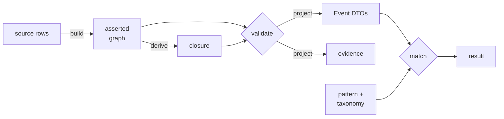

# Patient Trajectory Matching

[](https://github.com/MaastrichtU-IDS/patient-trajectory-matching/actions/workflows/contracts.yml)
[](LICENSE)
[](docs/validation.md#setup)

Finding patients whose clinical history follows a specified trajectory — an exposure followed by a measured change — over a **temporal knowledge graph** that keeps time, provenance and uncertainty explicit.

The hard part is not the search. It is saying precisely what a match means when records are incomplete, timestamps are ambiguous, clinical concepts are hierarchical, and "we found nothing" might mean the patient is healthy, the data is missing, or the clocks were never comparable. This repository is a set of **executable contracts** that pin those distinctions down.

```
Given: an administration of DrugA, followed within 48 hours by a creatinine
       rise of at least 0.3 mg/dL over a baseline, exposure no more than
       seven days before follow-up

Find:  patients whose recorded evidence satisfies that trajectory — and say
       exactly which relaxations, if any, were used and what they cost
```

## What this is, and is not

|  | |
|---|---|
| ✅ **Is** | A modeling contract for patient trajectories over a temporal knowledge graph |
| ✅ **Is** | Temporal profiles, evidence selection, mapping conformance and checked Rust semantic support with 809 contract checks |
| ✅ **Is** | A bounded research workspace connecting patient similarity, two refinements, cohort comparison and source evidence |
| ✅ **Is** | A specification set for the full product, with implementation status marked throughout |
| ❌ **Is not** | A production matcher |
| ❌ **Is not** | A complete OWL reasoner |
| ❌ **Is not** | A clinical ETL implementation or terminology release |
| ❌ **Is not** | A validated clinical phenotype |

Passing fixtures do not establish production readiness — the acceptance report records `production_readiness_claim: false` deliberately. All patient examples and the DrugA/DrugB alternatives are constructed. No MIMIC patient rows are redistributed here.

## Quick start

Python 3.12 for the pipelines; the dependency-free oracle runs on 3.10 or newer.

```sh
python3.12 -m venv .venv
. .venv/bin/activate                 # Windows: .venv\Scripts\Activate.ps1
python -m pip install -r patterns/requirements.lock.txt
```

```sh
python reference_oracle.py           # 16 cases, 7 property checks
python -m patterns.pro_solid         # point-anchor pipeline
python -m patterns.test_pro_solid    # 42 acceptance tests

python -m patterns.exact_intervals       # interval pipeline, 9 comparisons
python -m patterns.test_exact_intervals  # 51 conformance tests

python -m patterns.interval_cohort       # cohort query over intervals
python -m patterns.test_interval_cohort  # 18 contract and differential tests

python -m patterns.bounded_cohort         # possible/certain interval bindings
python -m patterns.test_bounded_intervals # 22 finite-world and certificate tests

python -m patterns.bounded_rdf            # bounded RDF export/ingestion
python -m patterns.test_bounded_rdf       # 21 RDF validation and evidence tests

python -m patterns.evidence_selection      # source-as-known selection and matching
python -m patterns.test_evidence_selection # 29 lifecycle and integration tests

python -m patterns.temporal_interface      # 8 paired fixtures, 33 query comparisons
python -m patterns.test_temporal_interface # 22 conformance and boundary tests
```

Installation needs network access. Everything after it runs offline — no Java, no clinical dataset, no AI provider credentials, no subscription.

Full instructions and expected output for every component: **[docs/validation.md](docs/validation.md)**

## Interactive demonstration

The [temporal uncertainty demonstration](docs/temporal-workspace.md) is available at
`/temporal` in the research workspace below. It shows certain, possible-only,
non-matching and incomparable histories, and how one explicit window widening
changes certainty while preserving the source evidence.

The **[integrated research workspace](docs/research-workspace.md)** connects query-by-example, two immutable refinements, exact versus relaxed cohort comparison, source inspection and replayable export over the same authored patients:

```sh
python -m app.server --host 127.0.0.1 --port 8080
```

For the **[guided patient-to-cohort demo](docs/guided-patient-journey.md)**, open
`http://127.0.0.1:8080/journey`. In 2–3 minutes, select an authored reference, compare
the original and relaxed temporal question across the full eligible population,
inspect readable evidence and unresolved clocks, and export the analysis for replay.
The guide uses a shared four-history population; its clinical outcomes are unrecorded.
The [configurable trajectory builder](docs/configurable-trajectory-builder.md) in the same
workflow lets you select two or three event slots and edit their temporal constraints,
inspect the canonical query, and replay the resulting cohort.
[Custom relaxation catalogues](docs/custom-relaxation-catalogue.md) let you explicitly
permit metric changes, compare up to three costed options, and retain the least-cost
certain match with each option's evidence.
The [recorded-evidence workflow](docs/guided-recorded-evidence.md) on the same page
connects recorded treatment segments to baseline and optional follow-up measurements.
Select an exact source item or a reviewed ontology concept, then inspect the measured
changes, missing follow-up, source rows and mapping evidence.
[Recorded query-by-example](docs/recorded-query-by-example.md) compares patients
using an explicit pre-segment measurement feature, keeps unresolved peers visible,
and exports the completed query and optional comparison for exact local replay.
The recorded pattern editor revises point/interval queries within admitted source
windows; explicit feature profiles add weighted pressure-history features with
per-feature evidence. Optional [durable jobs and owner access](docs/durable-recorded-workspace.md)
preserve completed recorded jobs across restarts. The [evaluation protocol](docs/recorded-workflow-evaluation.md)
separates technical source agreement from the remaining clinical review.
The [delivery and acceptance status](docs/recorded-workflow-delivery.md) lists the six
work areas and the external evidence still required.

Open `http://127.0.0.1:8080` after the dependency setup above. [Docker/Compose and Helm instructions](docs/deployment.md) package this bounded prototype. The [completion register](docs/completion.md) preserves all 104 original requirements and records partial implementation and remaining dependencies; the full product is unfinished.

The [guided cohort demo](demo/README.md) is a 2–3 minute investigation: start with a
patient, find exact matches, broaden the query, inspect the boundaries, and export
the evidence. Ten distinct synthetic candidates form a cohort that grows **3 → 5 → 6**.
The [timed presenter narrative](demo/NARRATIVE.md) includes the clicks and expected results.
From the repository root, with Python 3.10+:

```sh
python3 demo/serve.py
```

Open `http://127.0.0.1:8765`. The guided matcher needs no extra packages. Its inputs
were validated and projected through PRO/SOLID; each live query executes the Python
matcher. The standalone [guided replay](demo/Guided_Cohort_Demo.html) works offline
after downloading, with an explicit replay label.

The original technical examples remain at `/lab`. To install and check the optional
graph and Rust pipelines, run `python3.12 demo/start_demo.py`. This is a bounded
demonstration; the broader product workspace in `ui/` remains a specification.

## Four temporal profiles

The repository contains four independent executable contracts. They share the pinned SULO core and the PRO/SOLID representation discipline, but none of them changes the semantics of another.

| Profile | Entry point | What it decides |
|---|---|---|
| **Point anchor** (v2.4) | `patterns/pro_solid.py` | Three-slot exemplar matching with priced relaxation, over point-in-time events |
| **Exact interval** `1.0` | `patterns/exact_intervals.py` | Pairwise temporal operators over recorded start/end intervals |
| **Interval cohort** `1.0` | `patterns/interval_cohort.py` | Conjunctive slot queries across patient episodes, with indexed and exhaustive engines |
| **Bounded interval** `1.0` | `patterns/bounded_cohort.py` | Joint feasibility and fixed-witness certain/possible bindings over discrete uncertain times |

The [evidence-selection layer](docs/evidence-selection.md) prepares bounded snapshots from explicit source support, corrections and availability cutoffs. It preserves the temporal semantics of the bounded matcher.

[Reviewed measurement selectors](docs/reviewed-measurement-mappings.md) now use checked mapping rules to select source items and execute separate item/unit strata. The synthetic example preserves optional follow-up and matches literal-query/SQL controls; clinical pressure mappings remain pending.

[Clinical terminology candidates](docs/clinical-terminology-candidates.md) now identify concrete RxNorm and LOINC targets with source evidence and unresolved method distinctions. The norepinephrine mapping pack is complete but blocked by its empty review journal.

[Source-verified mapping catalogues](docs/source-record-catalogue.md) now reproduce item classes and supplied claims from pinned CSVs before mapped execution. The public-demo catalogue is available for terminology review; clinical targets remain pending.

[Reviewed record mappings](docs/reviewed-record-mappings.md) now compile explicitly accepted mapping proposals into checked one-way semantic rules. A synthetic mixed-query example executes; the [clinical mapping worksheet](data/clinical-terminology-review.json) remains pending domain review.

The [live pressure-query inspector](docs/live-pressure-inspector.md) now connects the local UI to the reviewed mixed-record engine, with bounded query controls, complete cohort counts, background progress and source/role evidence for each treatment anchor. [Changed query controls](docs/prepared-pressure-queries.md) now reuse checked batch preparation while recomputing temporal eligibility and SQL reconciliation. [Repeated identical queries](docs/pressure-query-cache.md) can reuse complete results after source/review checks, with explicit execution labels and timings.

The [cohort-overlap analysis](docs/pressure-cohort-overlap.md) reproduces all three pressure queries and identifies 23 distinct patients across 29 stays and 196 treatment segments. It distinguishes patient overlap from shared treatment anchors and keeps measurement strata separate.

The [three-stratum pressure comparison](docs/reviewed-pressure-strata.md) now completes the arterial, non-invasive and alternate arterial-label queries separately. Every run preserves all 944 anchors and 140 stays and agrees with unpartitioned SQL after its explicit automated source-fidelity review. Clinical interpretation remains unverified.

The [arterial demonstration](docs/reviewed-arterial-demo.md) explains the source-fidelity audit and explicit acceptance mechanism used by all three runs.

The [unique-claim review package](docs/unique-claim-review.md) now exposes each source claim once per request and propagates reviewed histories consistently to all batches. Demo packages and pending policies are verified; the subsequent three-stratum demonstration supplies separate explicit source-fidelity declarations.

The [partitioned window executor](docs/partitioned-window-query.md) now covers oversized exact-record windows with overlapping batches, explicit review and complete batch/anchor/stay accounting. All 2,832 public-demo anchor/stratum combinations have verified partition plans; all three strata now also have reviewed execution reports.

The [indexed source-window selector](docs/indexed-source-windows.md) now prepares complete per-anchor time windows with original row provenance. All 2,832 public-demo windows agree with a direct reference; oversized anchors remain blocked and claim exports remain pending.

The [clinical source preflight](docs/clinical-source-preflight.md) now verifies candidate norepinephrine/blood-pressure item coverage in the pinned public demo and identifies the need for indexed source-window selection before mixed-query execution. It publishes aggregate evidence only.

The [source mixed-query pipeline](docs/source-mixed-query.md) now connects both importers through explicit record review and compares exact baseline/follow-up bindings with an independent SQLite reference. Its synthetic example retains missing follow-up and all requested stays.

The optional [Rust semantic-support profile](docs/semantic-support.md) adds inferred process-class selectors through a restricted rule module, checked against an independent finite evaluator before temporal matching. Its 22 tests run in a separate CI job; install `patterns/requirements-semantic.lock.txt` to run them.

The [joint evidence-selection profile](docs/joint-evidence-selection.md) now selects temporal records and semantic assertions through the same revision chains and patient cutoffs before invoking Rust and temporal matching.

## How it works



The design rests on one decision: **the RDF graph is the semantic record; the projection is an execution representation.** Where they disagree, the graph wins. Every projected row carries an evidence identifier that leads back to the exact process, role, bearer, result and source record it came from — so a match is a claim with a traversable path, not a bare assertion.

Bounded-time matching accepts synthetic JSON or a supplied PRO/SOLID graph through the [bounded RDF input profile](docs/bounded-rdf-ingestion.md). The RDF route validates every input triple and preserves original resources, literal spellings, and source-hash declarations through temporal compilation.

Three things follow, and they are what this project is really about:

**Participation goes through roles.** `Process → hasParticipant → PatientRole → isFeatureOf → Person`. A trajectory joins on the same *person*, never the same role individual. Generic participation alone is explicitly insufficient — it does not establish which role the bearer held.

**Literals go through typed information objects.** `sulo:hasValue` is the only literal-bearing predicate in instance data, and the application extensions declare no new object or datatype properties at all. Domain distinction lives entirely in classes.

**Kinds of "no" stay distinct.** An ontology inconsistency, a profile violation, an unmatched trajectory and an incomparable clock are different failures with different meanings. A `ContractError` stops projection and is *never* reported as "patient does not match." `source_search_complete: false` yields `UNRESOLVED`, not `FAIL`. And two events on different clocks are `INCOMPARABLE` — not absent.

Full detail: **[docs/architecture.md](docs/architecture.md)**

## Documentation

Start at the **[documentation guide](docs/README.md)**, or go directly to:

| Page | Contents |
|---|---|
| [Architecture](docs/architecture.md) | Design, pipelines, constraint model, encoding, temporal semantics |
| [Components](docs/components.md) | What each part does, how to use it, what it depends on |
| [Specifications](docs/specifications.md) | The addenda and design documents, what each covers, reading order |
| [Status](docs/status.md) | Executable versus specified, by family and component |
| [Completion register](docs/completion.md) | Evidence and remaining clauses for all 104 original requirements |
| [Research workspace](docs/research-workspace.md) | Connected synthetic investigation, HTTP API and export replay |
| [Patient similarity](docs/patient-similarity.md) | Pre-index evidence, exact ranking, coverage and immutable refinements |
| [Deployment](docs/deployment.md) | Docker, Compose and single-replica Helm packaging |
| [Workload memory](docs/pressure-workload-memory.md) | Sampled process-tree RSS, provenance and measurement limits |
| [Outstanding issues](docs/issues.md) | Known gaps and open questions, each citing its source |
| [Running and validating](docs/validation.md) | Every command, expected output, troubleshooting |

**Profile contracts**

| Document | Subject |
|---|---|
| [PRO/SOLID addendum v2.4](addenda/specification-2.4.md) | The current point-anchor modeling contract |
| [Exact-interval profile](docs/exact-interval-profile.md) | Interval adapter, clocks, endpoint comparisons, evidence |
| [Interval cohort matching](docs/interval-cohort-matching.md) | Slot queries, indexed joins, differential reference |
| [Bounded temporal uncertainty](docs/bounded-temporal-uncertainty.md) | Shared variables, joint feasibility, fixed-witness certainty, certificates |
| [Bounded RDF ingestion](docs/bounded-rdf-ingestion.md) | Closed graph validation, explicit identifiers, preserved source evidence |
| [Mixed record queries](docs/mixed-record-query.md) | Baseline–treatment eligibility, explicit clock alignment and point follow-up |
| [Measurement point claims](docs/measurement-claims.md) | Scalar/point source claims, explicit record selection and chartevents admission |
| [MIMIC pending claim import](docs/mimic-claim-import.md) | Source provenance, complete row ledger and unaccepted recorded claims |
| [Patient-local claim projection](docs/local-claim-projection.md) | Local and recorded claim profiles, clock isolation and preserved date-label evidence |
| [Structured claims and controlled projection](docs/claim-projection.md) | Claim-only RDF, explicit acceptance, checked isolation and dependent retraction |
| [End-to-end recorded-source query](docs/mimic-record-query.md) | MIMIC CSV to RDF, checked semantic/temporal matching and complete reconciliation |
| [Patient-local clocks](docs/patient-local-clocks.md) | Explicit local datetime bounds, clock isolation, RDF round trip and bounded queries |
| [MIMIC inputevents staging](docs/mimic-inputevents-staging.md) | Source admission, row reconciliation, and explicit handoff blockers |

**Temporal design guidance**

| Document | Subject |
|---|---|
| [Temporal KG formal definition](docs/temporal-kg/) | The mathematical definition — graph, interpretation, matching, entailment. v2 fixes representation to OWL 2 DL and registers eleven open decisions |
| [SULO temporal interface](docs/temporal-kg/sulo-interface.md) | Paired conformance fixtures, mapping contract and classification of the original 18 checks |
| [v2 OWL validation evidence](docs/temporal-kg/validation/README.md) | Original ontologies, checker, logs and reproduction of the formal definition’s 18 checks; separate optional Java tooling |
| [SULO and OWL-Time review](docs/sulo-owl-time-review.md) | Representation, temporal identity, uncertainty, reasoning responsibilities, indexes |
| [Temporal precedence](docs/decisions/temporal-precedence.md) | Strict precedence, direct succession, temporal contact — a proposal, not adopted |

These develop the next temporal profiles. The precedence names and axioms remain proposals for a future SULO release; they are not additions to the pinned ontology or the current application vocabulary.

## Components

| Component | Path | Status |
|---|---|---|
| Reference oracle | `reference_oracle.py` | Executable — 16 cases, no dependencies |
| Research workspace | `app/` | Executable — bounded authored QBE/refinement/cohort/evidence journey |
| Patient similarity | `patterns/patient_similarity.py` | Executable — pre-index exact ranking and immutable refinements |
| Deployment package | `Dockerfile`, `deploy/helm/` | Research prototype packaging; target-cluster operation remains unverified |
| PRO/SOLID adapter | `patterns/pro_solid.py` | Executable — 5-stage point-anchor pipeline |
| Exact-interval adapter | `patterns/exact_intervals.py` | Executable — intervals, clocks, 4 operators |
| Interval cohort matcher | `patterns/interval_cohort.py` | Executable — indexed and reference engines |
| Bounded uncertainty matcher | `patterns/bounded_cohort.py` | Executable — discrete-time solver and finite-world checks |
| Bounded RDF adapter | `patterns/bounded_rdf.py` | Executable — closed graph validation and evidence-preserving compilation |
| Ontology profiles | `ontology/` | Executable — SULO 0.2.14, pinned and digest-checked |
| Contract schemas | `schemas/` | Mixed — interval-cohort and bounded schemas executable; 14 REST paths have no service |
| Fixtures | `examples/` | Mixed — executable inputs and specified cases |
| UI assets | `ui/` | Specified — wireframes and contracts, no interface |
| Evaluation plan | `evaluation/` | Specified — protocol, no measurements |
| MIMIC source staging | `patterns/mimic_inputevents.py` | Executable — 2.2 inputevents reconciliation; clinical/matcher handoff blocked |
| Dataset plans | `data/` | Specified — no MIMIC rows redistributed |

Per-component interfaces and scope limits: **[docs/components.md](docs/components.md)**

## Matching semantics

Decimal values and costs, integer microseconds, a declared clock.

| Relaxation | Cost |
|---|---|
| Exact match | 0 |
| Entailed subclass | 0 — entailment is not approximation |
| Reviewed semantic alternative | 1 |
| Exposure window beyond 7 days | Linear to 1 across 2 extra days |
| Value rise, 48-hour lab window | Hard — never relaxable |

A prescription or not-given event cannot satisfy administration. For uncertain exposure times, definite acceptance takes the worst cost over feasible point times — the conservatism runs in the safe direction.

The interval profiles use hard constraints without priced relaxation. The bounded profile preserves shared variables, returns jointly possible and fixed-witness certain bindings, and includes proof certificates. In every interval profile, a temporal edge requires the same clock resource and descriptor, and equal coordinate values do not establish a clock mapping.

The oracle searches recorded evidence. A missing baseline within a complete record scope is a record-query failure, not proof of clinical absence. It never claims this creatinine branch is a complete AKI phenotype, nor that exposure caused the lab change.

## Repository layout

```
addenda/        four versioned design specifications (2.4 is current)
patterns/       four executable profiles and their test suites
ontology/       SULO pin, application profiles, SHACL shapes, toy taxonomy
schemas/        JSON Schema and OpenAPI contracts
examples/       fixtures, exemplar pattern AST, worked graphs, SPARQL
verification/   generated reports and the hashed release manifest
docs/           documentation and temporal design guidance
ui/             wireframes, tokens, storyboard, interaction contracts
data/           dataset roles, demo inventory, MIMIC study plan
evaluation/     Graphiti comparison protocol
```

## Contributing

The contracts are the specification. Any change — human or AI-assisted — must keep them passing and must preserve the declared supported profile.

1. Read [docs/architecture.md](docs/architecture.md), then the contract for the profile you are changing
2. Run the suites in [docs/validation.md](docs/validation.md) before and after your change
3. If you widen a supported profile, add tests that pin the new boundary and say so explicitly
4. Keep implemented behaviour distinct from specified behaviour in every document you touch

CI runs all four profiles on every pull request, including a check that the regenerated point-anchor graph stays isomorphic to the committed copy.

Open gaps are catalogued in [docs/issues.md](docs/issues.md); the recommended implementation sequence is in the [documentation guide](docs/README.md).

## Citation and provenance

Companion to product specification v2.3, extended by the v2.4 addendum in this pack. The PRO and SOLID patterns follow [the SULO paper, sections 4.4.1–4.4.2](https://ceur-ws.org/Vol-4176/foust-7.pdf). The [SULO ontology](https://w3id.org/sulo/sulo.ttl) is vendored at version 0.2.14 and verified against its SHA-256 digest at load time; see `ontology/sulo-pin.json`.

## License

Pack contents are MIT licensed; see [LICENSE](LICENSE). The vendored SULO ontology is CC0 and is redistributed under its own terms. MIMIC-IV carries its own access requirements, independent of this license.

[Measurement source verification](docs/measurement-source-catalogue.md) now reproduces catalogue labels, supplied scalar claims and patient clock origins from pinned CSV files before reviewed measurement selection. Synthetic raw-CSV/Rust/SQL evidence is included; source acceptance and clinical mapping review remain separate.

[Prepared measurement sessions](docs/prepared-measurement-session.md) now reuse verified source and semantic preparation across changed numeric/temporal queries. Twelve synthetic prepared queries reproduce fresh results and raw-CSV SQL with no repeated audit, mapping planning, fresh mixed-query execution or network compilation.

The [live mapped pressure route](docs/mapped-pressure-service.md) now integrates reviewed measurement selection and prepared batches with the existing local HTTP interface. Run `python demo/serve_mapped_pressure.py` for the authored example. The changed-query benchmark preserves fresh results and anchor SQL checks; public clinical mappings remain pending.


The [configured mapped route](docs/configured-pressure-service.md) now accepts a local source/request/review configuration. Run `python demo/serve_mapped_pressure.py --config examples/configured-pressure-service/config.json` for the alternate item-2001 fixture with 15/60-minute windows. Configuration and review changes require a restart; no clinical mapping is accepted automatically.


The [configured workload runner](docs/configured-pressure-workload.md) now measures repeated prepared/cached queries against fresh mapped execution and every HTTP anchor inspection. It reports actual cache behavior and aggregate provenance for supplied configurations; the committed authored workload verifies six trials and 36 inspections.
