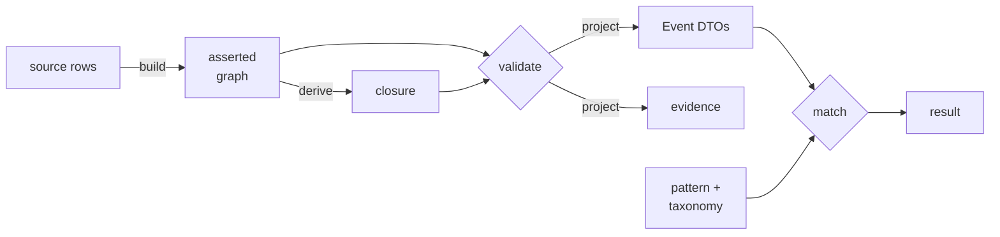

# Patient Trajectory Matching

[](https://github.com/MaastrichtU-IDS/patient-trajectory-matching/actions/workflows/contracts.yml)
[](LICENSE)
[](docs/validation.md#setup)

Finding patients whose clinical history follows a specified trajectory — an exposure followed by a measured change — over a **temporal knowledge graph** that keeps time, provenance and uncertainty explicit.

The hard part is not the search. It is saying precisely what a match means when records are incomplete, timestamps are ambiguous, clinical concepts are hierarchical, and "we found nothing" might mean the patient is healthy, the data is missing, or the clocks were never comparable. This repository is a set of **executable contracts** that pin those distinctions down.

```
Given: an administration of DrugA, followed within 48 hours by a creatinine
       rise of at least 0.3 mg/dL over a baseline, exposure no more than
       seven days before follow-up

Find:  patients whose recorded evidence satisfies that trajectory — and say
       exactly which relaxations, if any, were used and what they cost
```

## What this is, and is not

|  | |
|---|---|
| ✅ **Is** | A modeling contract for patient trajectories over a temporal knowledge graph |
| ✅ **Is** | Four temporal profiles and evidence selection with 206 passing checks |
| ✅ **Is** | A specification set for the full product, with implementation status marked throughout |
| ❌ **Is not** | A production matcher |
| ❌ **Is not** | A complete OWL reasoner |
| ❌ **Is not** | A clinical ETL implementation or terminology release |
| ❌ **Is not** | A validated clinical phenotype |

Passing fixtures do not establish production readiness — the acceptance report records `production_readiness_claim: false` deliberately. All patient examples and the DrugA/DrugB alternatives are constructed. No MIMIC patient rows are redistributed here.

## Quick start

Python 3.12 for the pipelines; the dependency-free oracle runs on 3.10 or newer.

```sh
python3.12 -m venv .venv
. .venv/bin/activate                 # Windows: .venv\Scripts\Activate.ps1
python -m pip install -r patterns/requirements.lock.txt
```

```sh
python reference_oracle.py           # 16 cases, 7 property checks
python -m patterns.pro_solid         # point-anchor pipeline
python -m patterns.test_pro_solid    # 42 acceptance tests

python -m patterns.exact_intervals       # interval pipeline, 9 comparisons
python -m patterns.test_exact_intervals  # 51 conformance tests

python -m patterns.interval_cohort       # cohort query over intervals
python -m patterns.test_interval_cohort  # 18 contract and differential tests

python -m patterns.bounded_cohort         # possible/certain interval bindings
python -m patterns.test_bounded_intervals # 22 finite-world and certificate tests

python -m patterns.bounded_rdf            # bounded RDF export/ingestion
python -m patterns.test_bounded_rdf       # 21 RDF validation and evidence tests

python -m patterns.evidence_selection      # source-as-known selection and matching
python -m patterns.test_evidence_selection # 29 lifecycle and integration tests
```

Installation needs network access. Everything after it runs offline — no Java, no clinical dataset, no AI provider credentials, no subscription.

Full instructions and expected output for every component: **[docs/validation.md](docs/validation.md)**

## Four temporal profiles

The repository contains four independent executable contracts. They share the pinned SULO core and the PRO/SOLID representation discipline, but none of them changes the semantics of another.

| Profile | Entry point | What it decides |
|---|---|---|
| **Point anchor** (v2.4) | `patterns/pro_solid.py` | Three-slot exemplar matching with priced relaxation, over point-in-time events |
| **Exact interval** `1.0` | `patterns/exact_intervals.py` | Pairwise temporal operators over recorded start/end intervals |
| **Interval cohort** `1.0` | `patterns/interval_cohort.py` | Conjunctive slot queries across patient episodes, with indexed and exhaustive engines |
| **Bounded interval** `1.0` | `patterns/bounded_cohort.py` | Joint feasibility and fixed-witness certain/possible bindings over discrete uncertain times |

The [evidence-selection layer](docs/evidence-selection.md) prepares bounded snapshots from explicit source support, corrections and availability cutoffs. It preserves the temporal semantics of the bounded matcher.

## How it works



The design rests on one decision: **the RDF graph is the semantic record; the projection is an execution representation.** Where they disagree, the graph wins. Every projected row carries an evidence identifier that leads back to the exact process, role, bearer, result and source record it came from — so a match is a claim with a traversable path, not a bare assertion.

Bounded-time matching accepts synthetic JSON or a supplied PRO/SOLID graph through the [bounded RDF input profile](docs/bounded-rdf-ingestion.md). The RDF route validates every input triple and preserves original resources, literal spellings, and source-hash declarations through temporal compilation.

Three things follow, and they are what this project is really about:

**Participation goes through roles.** `Process → hasParticipant → PatientRole → isFeatureOf → Person`. A trajectory joins on the same *person*, never the same role individual. Generic participation alone is explicitly insufficient — it does not establish which role the bearer held.

**Literals go through typed information objects.** `sulo:hasValue` is the only literal-bearing predicate in instance data, and the application extensions declare no new object or datatype properties at all. Domain distinction lives entirely in classes.

**Kinds of "no" stay distinct.** An ontology inconsistency, a profile violation, an unmatched trajectory and an incomparable clock are different failures with different meanings. A `ContractError` stops projection and is *never* reported as "patient does not match." `source_search_complete: false` yields `UNRESOLVED`, not `FAIL`. And two events on different clocks are `INCOMPARABLE` — not absent.

Full detail: **[docs/architecture.md](docs/architecture.md)**

## Documentation

Start at the **[documentation guide](docs/README.md)**, or go directly to:

| Page | Contents |
|---|---|
| [Architecture](docs/architecture.md) | Design, pipelines, constraint model, encoding, temporal semantics |
| [Components](docs/components.md) | What each part does, how to use it, what it depends on |
| [Specifications](docs/specifications.md) | The addenda and design documents, what each covers, reading order |
| [Status](docs/status.md) | Executable versus specified, by family and component |
| [Outstanding issues](docs/issues.md) | Known gaps and open questions, each citing its source |
| [Running and validating](docs/validation.md) | Every command, expected output, troubleshooting |

**Profile contracts**

| Document | Subject |
|---|---|
| [PRO/SOLID addendum v2.4](addenda/specification-2.4.md) | The current point-anchor modeling contract |
| [Exact-interval profile](docs/exact-interval-profile.md) | Interval adapter, clocks, endpoint comparisons, evidence |
| [Interval cohort matching](docs/interval-cohort-matching.md) | Slot queries, indexed joins, differential reference |
| [Bounded temporal uncertainty](docs/bounded-temporal-uncertainty.md) | Shared variables, joint feasibility, fixed-witness certainty, certificates |
| [Bounded RDF ingestion](docs/bounded-rdf-ingestion.md) | Closed graph validation, explicit identifiers, preserved source evidence |

**Temporal design guidance**

| Document | Subject |
|---|---|
| [Temporal KG formal definition](docs/temporal-kg/) | The mathematical definition — graph, interpretation, matching, entailment. v2 fixes representation to OWL 2 DL and registers eleven open decisions |
| [v2 OWL validation evidence](docs/temporal-kg/validation/README.md) | Original ontologies, checker, logs and reproduction of the formal definition’s 18 checks; separate optional Java tooling |
| [SULO and OWL-Time review](docs/sulo-owl-time-review.md) | Representation, temporal identity, uncertainty, reasoning responsibilities, indexes |
| [Temporal precedence](docs/decisions/temporal-precedence.md) | Strict precedence, direct succession, temporal contact — a proposal, not adopted |

These develop the next temporal profiles. The precedence names and axioms remain proposals for a future SULO release; they are not additions to the pinned ontology or the current application vocabulary.

## Components

| Component | Path | Status |
|---|---|---|
| Reference oracle | `reference_oracle.py` | Executable — 16 cases, no dependencies |
| PRO/SOLID adapter | `patterns/pro_solid.py` | Executable — 5-stage point-anchor pipeline |
| Exact-interval adapter | `patterns/exact_intervals.py` | Executable — intervals, clocks, 4 operators |
| Interval cohort matcher | `patterns/interval_cohort.py` | Executable — indexed and reference engines |
| Bounded uncertainty matcher | `patterns/bounded_cohort.py` | Executable — discrete-time solver and finite-world checks |
| Bounded RDF adapter | `patterns/bounded_rdf.py` | Executable — closed graph validation and evidence-preserving compilation |
| Ontology profiles | `ontology/` | Executable — SULO 0.2.14, pinned and digest-checked |
| Contract schemas | `schemas/` | Mixed — interval-cohort and bounded schemas executable; 14 REST paths have no service |
| Fixtures | `examples/` | Mixed — executable inputs and specified cases |
| UI assets | `ui/` | Specified — wireframes and contracts, no interface |
| Evaluation plan | `evaluation/` | Specified — protocol, no measurements |
| Dataset plans | `data/` | Specified — no MIMIC rows redistributed |

Per-component interfaces and scope limits: **[docs/components.md](docs/components.md)**

## Matching semantics

Decimal values and costs, integer microseconds, a declared clock.

| Relaxation | Cost |
|---|---|
| Exact match | 0 |
| Entailed subclass | 0 — entailment is not approximation |
| Reviewed semantic alternative | 1 |
| Exposure window beyond 7 days | Linear to 1 across 2 extra days |
| Value rise, 48-hour lab window | Hard — never relaxable |

A prescription or not-given event cannot satisfy administration. For uncertain exposure times, definite acceptance takes the worst cost over feasible point times — the conservatism runs in the safe direction.

The interval profiles use hard constraints without priced relaxation. The bounded profile preserves shared variables, returns jointly possible and fixed-witness certain bindings, and includes proof certificates. In every interval profile, a temporal edge requires the same clock resource and descriptor, and equal coordinate values do not establish a clock mapping.

The oracle searches recorded evidence. A missing baseline within a complete record scope is a record-query failure, not proof of clinical absence. It never claims this creatinine branch is a complete AKI phenotype, nor that exposure caused the lab change.

## Repository layout

```
addenda/        four versioned design specifications (2.4 is current)
patterns/       four executable profiles and their test suites
ontology/       SULO pin, application profiles, SHACL shapes, toy taxonomy
schemas/        JSON Schema and OpenAPI contracts
examples/       fixtures, exemplar pattern AST, worked graphs, SPARQL
verification/   generated reports and the hashed release manifest
docs/           documentation and temporal design guidance
ui/             wireframes, tokens, storyboard, interaction contracts
data/           dataset roles, demo inventory, MIMIC study plan
evaluation/     Graphiti comparison protocol
```

## Contributing

The contracts are the specification. Any change — human or AI-assisted — must keep them passing and must preserve the declared supported profile.

1. Read [docs/architecture.md](docs/architecture.md), then the contract for the profile you are changing
2. Run the suites in [docs/validation.md](docs/validation.md) before and after your change
3. If you widen a supported profile, add tests that pin the new boundary and say so explicitly
4. Keep implemented behaviour distinct from specified behaviour in every document you touch

CI runs all four profiles on every pull request, including a check that the regenerated point-anchor graph stays isomorphic to the committed copy.

Open gaps are catalogued in [docs/issues.md](docs/issues.md); the recommended implementation sequence is in the [documentation guide](docs/README.md).

## Citation and provenance

Companion to product specification v2.3, extended by the v2.4 addendum in this pack. The PRO and SOLID patterns follow [the SULO paper, sections 4.4.1–4.4.2](https://ceur-ws.org/Vol-4176/foust-7.pdf). The [SULO ontology](https://w3id.org/sulo/sulo.ttl) is vendored at version 0.2.14 and verified against its SHA-256 digest at load time; see `ontology/sulo-pin.json`.

## License

Pack contents are MIT licensed; see [LICENSE](LICENSE). The vendored SULO ontology is CC0 and is redistributed under its own terms. MIMIC-IV carries its own access requirements, independent of this license.
