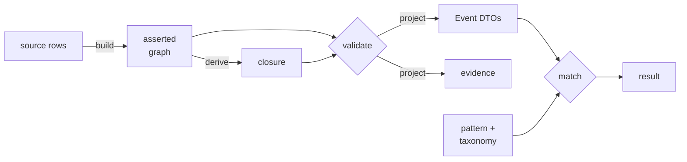

# Patient Trajectory Matching

[](https://github.com/MaastrichtU-IDS/patient-trajectory-matching/actions/workflows/contracts.yml)
[](LICENSE)
[](docs/validation.md#setup)

Finding patients whose clinical history follows a specified trajectory — an exposure followed by a measured change — over a **temporal knowledge graph** that keeps time, provenance and uncertainty explicit.

The hard part is not the search. It is saying precisely what a match means when records are incomplete, timestamps are ambiguous, clinical concepts are hierarchical, and "we found nothing" might mean the patient is healthy, the data is missing, or the query was wrong. This repository is a set of **executable contracts** that pin those distinctions down.

```
Given: an administration of DrugA, followed within 48 hours by a creatinine
       rise of at least 0.3 mg/dL over a baseline, exposure no more than
       seven days before follow-up

Find:  patients whose recorded evidence satisfies that trajectory — and say
       exactly which relaxations, if any, were used and what they cost
```

## What this is, and is not

|  | |
|---|---|
| ✅ **Is** | A modeling contract for patient trajectories over a temporal knowledge graph |
| ✅ **Is** | A runnable reference implementation of a bounded slice, with 16 oracle cases, 42 acceptance tests and 7 property checks passing |
| ✅ **Is** | A specification set for the full product, with implementation status marked throughout |
| ❌ **Is not** | A production matcher |
| ❌ **Is not** | A complete OWL reasoner |
| ❌ **Is not** | A clinical ETL implementation or terminology release |
| ❌ **Is not** | A validated clinical phenotype |

**10 of 104 requirements are executable.** The other 94 are specified designs. Passing fixtures do not establish production readiness — the acceptance report records `production_readiness_claim: false` deliberately.

All patient examples and the DrugA/DrugB alternatives are constructed. No MIMIC patient rows are redistributed here.

## Quick start

Python 3.12 for the full pipeline; the dependency-free oracle runs on 3.10 or newer.

```sh
python3.12 -m venv .venv
. .venv/bin/activate                 # Windows: .venv\Scripts\Activate.ps1
python -m pip install -r patterns/requirements.lock.txt

python reference_oracle.py           # 16 cases, 7 property checks
python -m patterns.pro_solid         # full pipeline on the synthetic fixture
python -m patterns.test_pro_solid    # 42 acceptance tests
```

```json
{"cases_passed": 16, "properties_passed": 7, "report": "verification/reference-report.json"}
{"events": 3, "accepted_as": "EXACT", "total_cost": "0", "output": ".../verification/pro-solid-run"}
```

Installation needs network access. Everything after it runs offline — no Java, no clinical dataset, no AI provider credentials, no subscription.

Full instructions and expected output for every component: **[docs/validation.md](docs/validation.md)**

## How it works



The design rests on one decision: **the RDF graph is the semantic record; the Event DTO is an execution representation.** Where they disagree, the graph wins. Every projected row carries an `assertion_id` that leads back to the exact process, role, bearer, result and source record it came from — so a match is a claim with a traversable path, not a bare assertion.

Three things follow from that, and they are what this project is really about:

**Participation goes through roles.** `Process → hasParticipant → PatientRole → isFeatureOf → Person`. A trajectory joins on the same *person*, never the same role individual. Generic participation alone is explicitly insufficient — it does not establish which role the bearer held.

**Literals go through typed information objects.** `sulo:hasValue` is the only literal-bearing predicate in instance data, and the application extension declares no new object or datatype properties at all. Domain distinction lives entirely in classes.

**Three kinds of "no" stay distinct.** An ontology inconsistency, a profile violation and an unmatched trajectory are different failures with different meanings. A `ContractError` stops projection and is *never* reported as "patient does not match." And `source_search_complete: false` yields `UNRESOLVED`, not `FAIL` — "we did not look everywhere" is not "it is not there."

Full detail: **[docs/architecture.md](docs/architecture.md)**

## Documentation

| Page | Contents |
|---|---|
| [Architecture](docs/architecture.md) | Design, pipeline, constraint model, encoding, temporal semantics |
| [Components](docs/components.md) | What each part does, how to use it, what it depends on |
| [Specifications](docs/specifications.md) | The four addenda, what each covers, reading order |
| [Status](docs/status.md) | Executable versus specified, by family and component |
| [Outstanding issues](docs/issues.md) | Known gaps and open questions, each citing its source |
| [Running and validating](docs/validation.md) | Every command, expected output, troubleshooting |

The current modeling contract is **[addendum 2.4](addenda/specification-2.4.md)**.

## Components

| Component | Path | Status |
|---|---|---|
| Reference oracle | `reference_oracle.py` | Executable — 16 cases, no dependencies |
| PRO/SOLID adapter | `patterns/pro_solid.py` | Executable — 5-stage pipeline |
| Acceptance suite | `patterns/test_pro_solid.py` | Executable — 42 tests |
| Ontology profile | `ontology/` | Executable — SULO 0.2.14, pinned and digest-checked |
| Contract schemas | `schemas/` | Structurally validated — 14 REST paths, no service |
| Fixtures | `examples/` | Mixed — executable inputs and specified cases |
| UI assets | `ui/` | Specified — wireframes and contracts, no interface |
| Evaluation plan | `evaluation/` | Specified — protocol, no measurements |
| Dataset plans | `data/` | Specified — no MIMIC rows redistributed |

Per-component interfaces and scope limits: **[docs/components.md](docs/components.md)**

## Matching semantics

Decimal values and costs, integer microseconds, a declared clock.

| Relaxation | Cost |
|---|---|
| Exact match | 0 |
| Entailed subclass | 0 — entailment is not approximation |
| Reviewed semantic alternative | 1 |
| Exposure window beyond 7 days | Linear to 1 across 2 extra days |
| Value rise, 48-hour lab window | Hard — never relaxable |

A prescription or not-given event cannot satisfy administration. For uncertain exposure times, definite acceptance takes the worst cost over feasible point times — the conservatism runs in the safe direction.

The oracle searches recorded evidence. A missing baseline within a complete record scope is a record-query failure, not proof of clinical absence. It never claims this creatinine branch is a complete AKI phenotype, nor that exposure caused the lab change.

## Repository layout

```
addenda/        four versioned design specifications (2.4 is current)
patterns/       the executable PRO/SOLID pipeline and its acceptance suite
ontology/       SULO pin, application profile, SHACL shapes, toy taxonomy
schemas/        JSON Schema and OpenAPI contracts
examples/       fixtures, exemplar pattern AST, worked graph, SPARQL
verification/   generated reports and the hashed release manifest
docs/           this documentation
ui/             wireframes, tokens, storyboard, interaction contracts
data/           dataset roles, demo inventory, MIMIC study plan
evaluation/     Graphiti comparison protocol
```

## Contributing

The contracts are the specification. Any change — human or AI-assisted — must keep them passing and must preserve the declared supported profile.

1. Read [docs/architecture.md](docs/architecture.md), then [addendum 2.4](addenda/specification-2.4.md)
2. Run the suites in [docs/validation.md](docs/validation.md) before and after your change
3. If you widen the supported profile, add acceptance tests that pin the new boundary and say so explicitly
4. Keep implemented behaviour distinct from specified behaviour in every document you touch

CI runs the full suite on every pull request, including a check that the regenerated graph stays isomorphic to the committed copy.

The next implementation assignments, from [addendum 2.4 §8](addenda/specification-2.4.md): ontology and domain mapping with review; source adapters with reconciliation; matcher integration; evidence-driven UI. Open gaps are catalogued in [docs/issues.md](docs/issues.md).

## Citation and provenance

Companion to product specification v2.3, extended by the v2.4 addendum in this pack. The PRO and SOLID patterns follow [the SULO paper, sections 4.4.1–4.4.2](https://ceur-ws.org/Vol-4176/foust-7.pdf). The [SULO ontology](https://w3id.org/sulo/sulo.ttl) is vendored at version 0.2.14 and verified against its SHA-256 digest at load time; see `ontology/sulo-pin.json`.

## License

Pack contents are MIT licensed; see [LICENSE](LICENSE). The vendored SULO ontology is CC0 and is redistributed under its own terms. MIMIC-IV carries its own access requirements, independent of this license.
