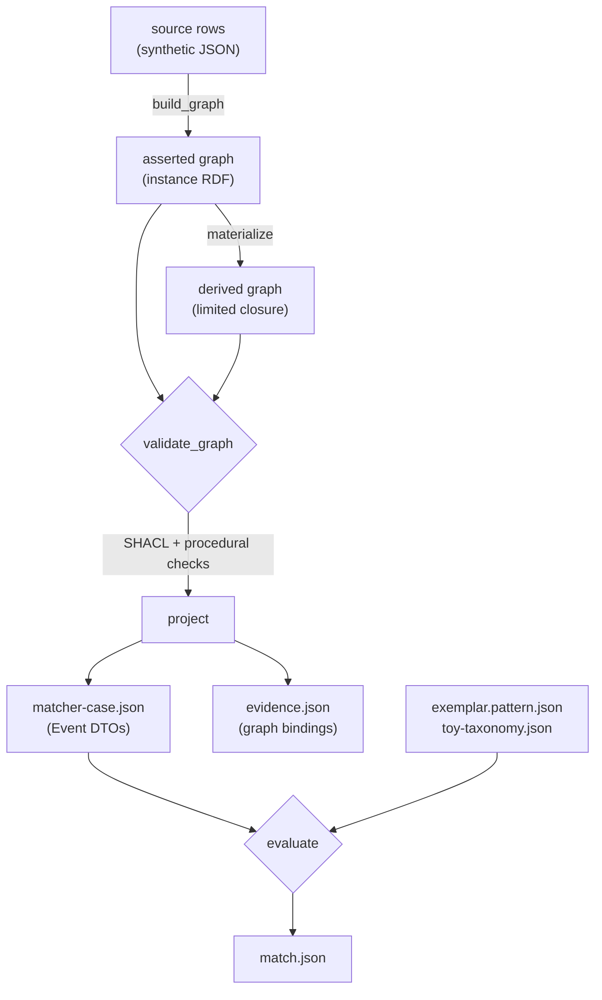

# Architecture

How the system is designed, what executes today, and where the boundaries are.

Status labels used throughout this documentation:

| Label | Meaning |
|---|---|
| **Executable** | Code runs and fixtures pass in CI |
| **Specified** | Designed in an addendum; no implementation |
| **Out of scope** | Explicitly excluded from the bounded profile |

## 1. The central split

One decision shapes everything else: **the RDF graph is the semantic record, and the Event DTO is an execution representation.**

These are not two views of equal standing. `patient_id`, `value`, `unit` and `time.start_min_us` are not SULO properties. They are a flattened projection built for indexing and scoring. Where the two disagree, the graph is authoritative.

`evidence.json` is the join between them. Every projected row carries an `assertion_id` (`pro-solid:` followed by the SHA-256 of its binding), and the evidence file maps that identifier back to the exact process, role, bearer, result datum, measured quality, unit resource and source record it came from. A match is therefore never a bare assertion; it is a claim with a traversable path back into the graph.

The bounded-time matcher has JSON and RDF input routes. The [bounded RDF reader](bounded-rdf-ingestion.md) validates a supplied graph, extracts normalized records, and attaches original graph resources and source declarations to the shared temporal compiler's evidence.

The evidence identifier is a deterministic identifier for an extracted binding. It is not a new assertion of clinical truth and not an OWL proof.

## 2. Pipeline

**Executable.** Implemented in [`patterns/pro_solid.py`](../patterns/pro_solid.py). This is the point-anchor profile; the interval profiles in [§5](#5-temporal-architecture) have their own adapters and reuse the same construct/validate/project discipline.



| Stage | Function | Responsibility |
|---|---|---|
| Construct | `build_graph` | Synthetic source rows to instance RDF. Not a MIMIC or FHIR importer. |
| Derive | `materialize` | Named subclass closure, `hasFeature` inverse, PRO participation chain. |
| Validate | `validate_graph` | SHACL shapes plus procedural checks; raises `ContractError`. |
| Project | `project` | Event DTOs plus separate binding evidence. |
| Match | `evaluate` | Exhaustive three-slot oracle over projected events. |

### Why derivation is a separate graph

`materialize()` computes closure into a **separate** graph, leaving asserted triples independently addressable. This separation is load-bearing.

In `project()`, the drug's clinical concept is read with `(drug, RDF.type, cls) in source` — from the *asserted* graph, deliberately not the closure. So `DrugAChild` projects as `DrugAChild`, not as its parent.

The consequence is that **the RDF layer never performs semantic matching.** It validates structure and hands the oracle an asserted concept. The oracle then performs subclass entailment against its own JSON toy taxonomy. Two reasoning inputs are kept deliberately apart, so "is DrugAChild a DrugA?" is answered by a small function over a JSON dictionary rather than by an OWL reasoner.

This is a seam, not a solution. A real terminology service replaces the taxonomy without touching the RDF layer or the matcher.

## 3. The three-level constraint model

Three kinds of "no," which most clinical tooling collapses into one:

| Level | Defined in | A violation means |
|---|---|---|
| Ontology axioms | SULO plus `pro-solid-profile.ttl` | The graph is logically inconsistent |
| Ingestion constraints | `pro-solid-shapes.ttl` plus procedural checks | The data falls outside the supported profile |
| Query constraints | Pattern AST, evaluated by the oracle | This patient's trajectory does not fit |

A `ContractError` stops projection outright. It is **never** returned as "patient does not match." A structurally valid graph can still yield no accepted trajectory.

The failure vocabulary keeps four things distinct that are routinely conflated:

- missing data within the supported profile
- absence of recorded evidence
- ontology inconsistency
- actual clinical absence

The sharpest expression is `source_search_complete: false`, which yields `INDETERMINATE` / `UNRESOLVED` rather than `FAIL`. "We did not look everywhere" is architecturally distinct from "it is not there."

The interval cohort profile adds a fourth outcome in the same spirit. Two events recorded on different clocks are `INCOMPARABLE` — the query could not be decided, because nothing establishes a mapping between the clocks. That is neither a match nor an absence, and it is reported as its own verdict rather than folded into either.

See [issues.md](issues.md) for the gaps this model exposes but does not yet close.

## 4. PRO and SOLID encoding

**Executable.** Specified in [addendum 2.4](../addenda/specification-2.4.md).

### Participation through roles

Participation is always mediated by a role:

```
Process --hasParticipant--> PatientRole --isFeatureOf--> Person
```

A trajectory joins on the **same person**, never the same role individual. The profile requires a distinct role individual per process, enforced by `ROLE_REUSED_ACROSS_PROCESSES`.

The derived generic participation triple (`process hasParticipant person`) is explicitly **insufficient** on its own. Generic participation does not establish which role the bearer held, so query evaluation must retain the role witness even when the closure also contains the direct triple.

### Literals through information objects

SOLID means Single Object Literal Information Datum. Every literal hangs off a typed information object via `sulo:hasValue`, which is the **only** literal-bearing predicate permitted in instance data.

The application extension declares **no new object properties and no new datatype properties**. All domain distinction lives in classes: `PatientRole`, `AdministeredDrugRole`, `CreatinineResult`, `SourceRecord`, and typed identifier or status data.

`validate_graph` enforces this directly:

- a literal on any other predicate raises `SOLID_LITERAL_PROPERTY`
- a literal on a non-`InformationObject` subject raises `SOLID_INFORMATION_OBJECT`
- any predicate outside `rdf:type` and the six permitted SULO object properties raises `UNSUPPORTED_OBJECT_PROPERTY`

The permitted object properties are `hasParticipant`, `isFeatureOf`, `hasFeature`, `hasPart`, `refersTo` and `atTime`.

The payoff is a vocabulary that stays small and fixed while the domain grows through classes alone. The cost is verbosity: one lab value becomes a result object, a measured quality, a unit resource and an anchor time.

Ontology annotations and SHACL configuration are separate from instance data and may contain their own literals.

## 5. Temporal architecture

Four executable profiles handle time differently, on purpose. None changes the semantics of another.

### Point-anchor profile (v2.4)

Point anchors only, normalized to **integer microseconds** against a declared clock origin, using exact decimal arithmetic.

The adapter refuses to guess. It rejects timezone-free datetimes, the unknown `-00:00` offset, invalid offsets, leap seconds and sub-microsecond precision. It does not infer UTC from an absent timezone, and it does not apply timezone assumptions to deidentified dates.

Source datetime text is retained in evidence, including its serialized fractional digit count. The Event DTO's `precision` field describes the implemented serialization category, not uncertainty about clinical occurrence time.

An occurrence anchor does **not** establish that a clinical process had zero duration. Point anchors are this profile's simplification, not the product's temporal model — which is why the interval profiles exist alongside it rather than inside it.

### Exact-interval profile 1.0

Implemented in [`patterns/exact_intervals.py`](../patterns/exact_intervals.py), with its own class module and shapes (`ontology/exact-interval-profile.ttl`, `exact-interval-shapes.ttl`) in the `ei:` namespace. Contract: [exact-interval-profile.md](exact-interval-profile.md).

Processes carry an `ei:ExactOccurrenceInterval` with **distinct typed start and end descriptors** and no scalar `hasValue` on the interval itself. Each boundary has one `xsd:dateTimeStamp` and a direct Second unit. A clock binding links the interval to a temporal reference system.

For proper intervals `A = [sA,eA)` and `B = [sB,eB)` under one compatible clock:

| Operator | Satisfied exactly when |
|---|---|
| `before` | `eA < sB` |
| `meets` | `eA == sB` |
| `overlaps` | `sA < sB < eA < eB` — directional Allen overlap |
| `gap` | `min_gap_us <= sB - eA <= max_gap_us`, bounds inclusive, `0 <= min <= max` |

Overlapping intervals have a negative signed endpoint gap and therefore do not satisfy a nonnegative-gap request. A computed gap is a signed difference, **not** a SULO Duration assertion. For comparable inputs the evaluator also reports the single basic Allen relation, including containment, equality and inverses, though the request interface exposes only the four operators above.

`SATISFIED` and `NOT_SATISFIED` describe one exact temporal constraint on a selected recorded pair. Neither establishes cohort membership or clinical absence.

The precedence names `precedes`, `directlyPrecedes` and `immediatelyPrecedes` are **not** materialized into SULO by this evaluator. See [decisions/temporal-precedence.md](decisions/temporal-precedence.md) — a proposal, not an adopted change.

### Interval cohort profile 1.0

Implemented in [`patterns/interval_cohort.py`](../patterns/interval_cohort.py), over the validated exact-interval projection. Contract: [interval-cohort-matching.md](interval-cohort-matching.md).

Conjunctive queries bind required, distinct interval slots within a patient episode. Two engines run the same semantics — an indexed join and an exhaustive reference — and the test suite checks them differentially. That is the strongest correctness property in the repository: an optimization is held to an independently written specification of the same answer.

Comparability is strict. **A temporal edge requires exactly the same clock resource and descriptor.** Equal coordinate values or equivalent-looking origins do not establish a clock mapping. No comparison crosses patient episodes.

Binding outcomes compose into an episode verdict:

| Episode verdict | When |
|---|---|
| `MATCH` | Some binding satisfies every constraint |
| `INCOMPARABLE` | No match, and some binding has no false constraint but an incomparable edge |
| `NO_RECORDED_MATCH` | Otherwise |

A `MATCH` episode can still carry unresolved bindings, and they stay visible. An unresolved binding describes **missing comparability**, not a proven possible realization of an uncertain temporal system.

`search_complete: true` means all matching and unresolved bindings were enumerated over the represented, validated snapshot — no truncation, no approximate retrieval, no early stop. It does not assert complete clinical records, absence in reality, or full certain-answer semantics.

One precondition worth noting: the total endpoint span within each patient/episode/clock group must fit a signed 64-bit positive difference, checked before either search and including unselected events. This is deliberately stricter than admitting arbitrary individually valid int64 coordinates, so that index pruning cannot hide an overflow that pair evaluation would expose.

### Bounded interval profile 1.0

Implemented in [`patterns/bounded_cohort.py`](../patterns/bounded_cohort.py), with the source adapter in `bounded_intervals.py` and exact-integer temporal closure in `temporal_stn.py`. Contract: [bounded-temporal-uncertainty.md](bounded-temporal-uncertainty.md).

Each endpoint refers to a shared temporal variable with finite inclusive microsecond bounds. Source difference constraints preserve correlations, including offsets from shared anchors. The source network must be feasible before any query executes. Possibility checks the conjunction of all query atoms; certainty tests entailment from the original source network. A certain patient result requires the same named binding to work in every feasible timeline.

Results distinguish CERTAIN, POSSIBLE, IMPOSSIBLE, and INCOMPARABLE bindings and retain feasible witnesses, counterexamples, entailment paths, or negative-cycle certificates. No exact timestamp is asserted for an uncertain endpoint. The JSON route generates PRO/SOLID evidence. The separate `bounded-rdf-1.0` input profile validates supplied named-instance graphs and preserves their evidence. RDF outside its closed structure and optimized uncertainty indexes remain outside scope.

### Still specified

[Addendum 2.1 §6](../addenda/specification-2.1.md) specifies the full temporal semantics: the complete Allen catalogue, jointly feasible uncertain endpoints, metric gaps with explicit endpoints, calendar-aware age handling, and a normalization envelope retaining raw value, semantic kind, source unit, calendar, offset, precision, bounds and policy version.

[Addendum 2.3](../addenda/specification-2.3.md) specifies the bitemporal layer, separating occurrence time from assertion applicability. Temporal replay distinguishes:

- **source-as-known** — applies a declared availability cutoff, using only corrections available by that cutoff
- **retrospective reconstruction** — may use later corrections, under a mandatory distinct mode label

The two modes cannot be silently interchanged. A correction creates a successor assertion linked to its predecessor; it does not move or delete the event.

The [evidence-selection profile](evidence-selection.md) now implements these two selection modes for normalized bounded assertion bundles and explicit source revision chains. It uses current pinned semantics in both modes and blocks definitive results when admissible-source availability or declared archive history is incomplete. Historical ontology replay, derived-index replay and the broader bitemporal service remain open.

The bounded profile implements a discrete conjunctive subset of [sulo-owl-time-review.md](sulo-owl-time-review.md) §11. Dense-time semantics, general temporal disjunction, clock reconciliation, broader RDF mappings, and full semantic reasoning remain unimplemented.

## 6. Matching and cost

**Executable.** Implemented in [`reference_oracle.py`](../reference_oracle.py).

| Outcome | Cost |
|---|---|
| Exact concept match | 0 |
| Entailed subclass | 0 — entailment is not approximation |
| Reviewed semantic alternative | 1 |
| Temporal extension beyond the 7-day limit | Linear up to 1 across 2 extra days |
| Value rise, 48-hour lab window | Hard; never relaxable |

Budgets cap both the number of relaxed constraints and total cost. A prescription or not-given event cannot satisfy administration.

For uncertain exposure times, definite acceptance takes the **worst** cost over feasible point times, then minimizes that cost over event bindings. The conservatism runs in the safe direction.

The oracle searches recorded evidence. A missing baseline within a complete selected record scope is a record-query failure, not proof of clinical absence. The oracle never claims that this creatinine branch is a complete AKI phenotype, nor that exposure caused the lab change.

## 7. Dependency direction

`reference_oracle.py` has **zero third-party dependencies** and is imported *by* `pro_solid.py`, never the reverse.

```
reference_oracle.py   (stable core, stdlib only)
        ▲
        │ imports
        │
patterns/pro_solid.py (replaceable edge, rdflib + pyshacl)
```

The oracle is the stable core; the adapter is the replaceable edge. This is why the oracle runs unchanged on Python 3.10 through 3.13 while the pipeline needs the pinned RDF stack, and why a future clinical source adapter can be written without touching matcher semantics.

The interval profiles follow the same rule from the other direction: `interval_cohort.py` builds on the validated exact-interval projection, and `interval_cohort_reference.py` implements the same query semantics independently so the indexed engine can be checked against it. Neither touches the point-anchor oracle.

## 8. Contract surfaces and their versions

Several contract surfaces exist at **different versions**, which is easy to misread:

| Surface | Version | Describes |
|---|---|---|
| `schemas/openapi.json` | 2.0.0 | 14 REST paths over the Event model |
| `schemas/contracts.schema.json` | 2.0 | 22 JSON Schema definitions |
| Graph contract | 2.4 | PRO/SOLID role and bearer model |
| `schemas/interval-cohort.schema.json` | 1.0 | Interval cohort query contract — **executable** |
| `schemas/bounded-interval.schema.json` | 1.0 | Bounded source and query contracts — **executable** |

The OpenAPI document describes the pre-PRO/SOLID event model and **contains no role or bearer vocabulary at all**. The projection stage is what bridges the 2.4 graph to the 2.0 DTOs.

A reader who opens `openapi.json` first will not find the architecture described on this page. That relationship is deliberate — the DTO is a projection — but it is not self-evident from the file. None of the 14 REST paths have an implementation behind them.

The interval-cohort and bounded-interval schemas are live contracts, validated and enforced on every run, with additional semantic checks.

## 9. Ontology layering

| Layer | File | Role |
|---|---|---|
| Upper ontology | `ontology/vendor/sulo-0.2.14.ttl` | SULO, vendored and SHA-256 pinned |
| Pin record | `ontology/sulo-pin.json` | Version, digest, source URL, reasoning profile |
| Application profile | `ontology/pro-solid-profile.ttl` | 25 application classes, disjointness axioms |
| Ingestion shapes | `ontology/pro-solid-shapes.ttl` | 10 SHACL node shapes |
| Interval profile | `ontology/exact-interval-profile.ttl` | `ei:` interval, boundary, clock and duration classes |
| Bounded profile | `ontology/bounded-interval-profile.ttl` | Variables, bounds, constraint bindings; classes and individuals only |
| Bounded RDF input | `ontology/bounded-rdf-profile.ttl` | Explicit profile, variable, and constraint identifier classes |
| Interval shapes | `ontology/exact-interval-shapes.ttl` | SHACL shapes for the interval profile |
| Matcher taxonomy | `ontology/toy-taxonomy.json` | The oracle's only reasoning input |
| Archived drafts | `ontology/legacy-2.3/` | **Non-normative.** Must not be loaded with the current profile. |

SULO is verified against its digest at load time; a mismatch raises `SULO_PIN_MISMATCH`. Importing the full ontology does not imply the runner reasons over all its axioms. Arbitrary OWL expressions, existential witness generation and complete consistency checking are out of scope.

Disjointness is checked only across named upper categories the profile needs — `Object`/`Process`, `SpatialObject`/`Feature`, the role/quality/information/capability group, the temporal group, `Time`/`Unit` and `Collection`/`Quantity`. This does not replace OWL consistency checking for arbitrary class expressions.

## 10. Known modeling simplifications

Documented in the addendum and repeated here so they are not mistaken for oversights:

- **Quality at patient level.** The measured quality is a feature of the person. A specimen-based laboratory adapter must explicitly model the specimen, sampling process and roles rather than assuming specimen and patient are the same bearer. Not implemented.
- **One snapshot per matcher run.** The [bounded selection layer](evidence-selection.md) can prepare a snapshot from explicit source-support revisions and availability cutoffs. Historical ontology/mapping replay and the full 2.3 replay service remain unimplemented.
- **No observation merging.** Equal observed values do not justify merging observations. Each record, result datum and process keeps a distinct identifier.
- **Closed status set.** Only performed measurements and administrations are accepted. Not-given, planned, refused and prescription records are rejected at ingestion and never created as completed administrations.

## Next

- [components.md](components.md) — what each part does and how to use it
- [status.md](status.md) — what is executable versus specified
- [issues.md](issues.md) — outstanding gaps and open questions
- [validation.md](validation.md) — how to run and check each component


## Checked semantic support for bounded matching

The optional [semantic-support profile](semantic-support.md) now occupies part of the reasoning interface: it combines a selected snapshot's named process/PRO projection with an explicit restricted rule module, obtains class instances and consistency from pinned rustDL, and checks both against an independent finite evaluator before joining temporal candidates. It supports inferred process classes while preserving the original role/bearer witnesses and fixed-witness certainty. The generated module does not import the full SULO ontology. Arbitrary OWL, identity normalization and clinical source mapping remain outside this integration. The [joint selection profile](joint-evidence-selection.md) now selects normalized temporal and semantic fact bundles through one revision history before invoking the semantic gate; it retains current-rule semantics and caller-declared history coverage. The point-anchor oracle continues to use its original toy taxonomy.
